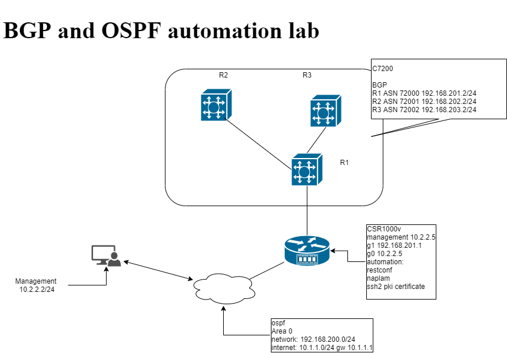

# Run BGP on differnt VCP and automation

This lab is setup with ospfd with quagga running on linux host and advertise network 192.168.200.0/22,
management network on 10.2.2.0/24.
This setup will explore the different automation with ansible 

1, setup lab in GNS3 
2, inventory managed in ansible
    


router | model| version 
-----  |------| -------
R1 | CSR1000v | ios-ex
R2 | C7200 | ios 15.2(4)M7
R3 | C7200 | ios 15.2(4)M7
R4 | C7200 | ios 15.2(4)M7

10.2.2.2 -> R1---R2---R3

BGP advertise and route 
R1 192.168.200.3/24
R2 192.168.201.3/24
R3 192.168.202.3/24

ASN 0

Kubernetes cluster 172.18.0.5/16 
use Ambassador 

## Ansible with Naplam
Ansible requirement:

- install naplam-ansible
```
pip3 install napalm-ansible
pip3 install napalm

- added napalm-ansible to library and action_plugins on ansible.cfg
    run napalm-ansible to get path information.
```

[defaults]
library = ~/.local/lib/python3.8/site-packages/napalm_ansible/modules
action_plugins = ~/.local/lib/python3.8/site-packages/napalm_ansible/plugins/action
```

### ncclient 
https://github.com/ncclient/ncclient/tree/master/examples

ansible:
    role:
        - cisco_ios
        - ansible Network Engine Role
            ansible-galaxy install ansible-network.network-engine
            ansible-galaxy collection install ansible.netcommon

